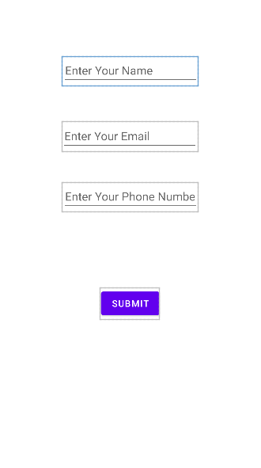
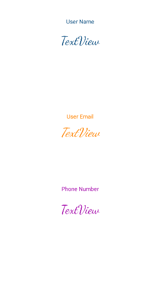

# The Simple Multiscreen App 
[android studio](https://developer.android.com/studio?gclsrc=ds&gclsrc=ds "android studio home")

_this contain a activity which take **name** **email** and **phone number** and display it in another activity_

